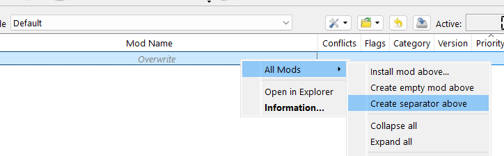

# Cyberpunk 2077 Modding

## Getting Started

Cyberpunk 2077 modding is quite rich, but most focus is on either installing
mods by hand or by using Vortex.  Vortex is fine for smaller lists but
struggles to be performant with larger load orders.  Worse, it's load order
sorting is so limited as to be nearly useless if you have more than a dozen
mods that need sorting.

As such, this guide uses Mod Organizer 2 -- its as capable as Vortex, even
if its not quite as sophisticated with Cyberpunk as it is with Bethesda
games.

This guide was made with Cyberpunk 2.13. 

### 7Zip

If you don't yet have 7zip, you'll need to install it. It's a compression
tool that can handle `7z` files, which some of our other tools are
distributed with.  Get it from the [7-Zip
website](https://www.7-zip.org/download.html).

### Downloading Mod Organizer 2

You can get it from the [Mod Organizer 2 Github
releases](https://github.com/ModOrganizer2/modorganizer/releases).  If you
already have a copy you can use that, but it needs to be at least version
2.5.0. To get it, scroll down the "Assets" section and grab the `7z` version, not the `exe` version:

### Installing Mod Organizer 2

The next step is to make a directory where you'll be running MO2 from and
where you'll store your mods.  You'll need around 10GB of free space for
this guide.  A faster disk will give a better experience, but as Cyberpunk
does not use loose assets, this is less important than with Bethesda
modding.  Personally, I put MO2 on my fastest NVME disk, which is also where
Cyberpunk itself is installed.

I made a directory for Cyberpunk modding called `E:\Cyberpunk2077` and and
`E:\Cyberpunk2077\Intro` to hold this MO2 for this guide.

Extract the Mod Organizer archive you downloaded into this new folder. It
should look like this:

Now double click `ModOrganizer.exe`:

1. First it will ask you want kind of instance you want to create. Pick "portable".
2. Obviously, pick Cyberpunk 2077 from the list of games. If it's not
   included in the list, scroll down to the bottom and find the folder.  (In my
   case the folder is `E:\GOGLibrary\Cyberpunk 2077`.)
3. Pick your profile defaults as you like. You can change your mind later.
   (The savegames feature is a little broken by the fact that the game will try
   to sync your saves to the cloud.  The result is that while MO2 will store
   profile specific saves, they may end up copied between profiles by the game
   itself.
4. Next it asks where your mods should be stored. If you might want to try a different mod list someday, you may want to used a shared download folder. Similarly, you can save some space on your fast NVME disk by pointing the download folder to a slow disk. If you don't need a different download folder, just hit next, otherwise:
   a. Check the "Show advanced options" to be able to edit specific paths.
   b. Change the Downloads path to point somewhere else. I have my set to
      `K:/Cyberpunk2077` -- my `K:` drive is a large spinning metal drive... 
      slow but cheap.
5. Finally it shows a confirmation screen with your choices. Click Finish.
6. Now it'll ask you if need help modding the game. You can see [those docs
   here](https://github.com/ModOrganizer2/modorganizer-basic_games/wiki/Game:-Cyberpunk-2077). 
   This guide will cover everything that you need to know but the docs are still
   useful as reference material.
7. Next it'll ask you how it should handle categories. Just click "Import
   Nexus Categories".

### Configuring Mod Organizer 2

#### Connect to Nexus

If you haven't used Mod Organizer 2 before, you'll need to connect it to your nexus account.

1. Go to the `Tools` menu and pick `Settings`.
2. Click on the "Nexus" tab.
3. Click "Connect to Nexus" this will open a browser window.
  a. If you aren't logged in it'll show you a login prompt. Go ahead and login.
  b. After logging in it may show you an "Error: Page not found" screen. If it does, go back to Mod Organizer and click "Cancel" and then "Connec to Nexus again". 
4. Click the orange `Authorise` button. Then go back to Mod Organizer and click OK to close the settings panel. If it prompts you to restart Mod Organizer, do so.

#### Load Order Configuration

Historically most modding of Cyberpunk used alphabetical sorting of the mod
list by file name to determine load order.  That's the default for MO2, but you
can make the load order match your modlist (letting you easily manually control load order). We'll be doing that:

1. Go to the `Tools` menu and pick `Settings`. Then click on the `Plugins`
   tab and find the `Cyberpunk 2077 Support Plugin` under `Game`.
2. Enable `enforce_archive_load_order` -- this will make your load order
   match your modlist in mo2.
3. Enable `reverse_archive_load_order` and `reverse_redmod_load_order`. 
   These are for two different types of mods that each have their own
   loadorders.  We'll discuss them later.  What these options do is make it
   so that mods lower in your modlist will override mods higher in your
   modlist.  That is, it will follow the same rules that MO2 uses for loose
   files (and also how Bethesda games work). The only caveat is that mod
   descriptions may tell you to "load this mod above x" or "before x" and
   you need to reverse that in MO2.

#### Root Builder

Next, you'll need to download [Root
Builder](https://github.com/Kezyma/ModOrganizer-Plugins/releases/tag/rootbuilder)
from another Github releases page.  Get the most recent version.  (At the
time of writing that's `5.0.5`.)

Root Builder is a MO2 plugin that allows it to copy (rather than overlay
with UVFS) files to the game folder.  This is necessary for some DLLS and
support files that need to be available very early in the startup of the
game.  MO2's Cyberpunk support automatically configures Root Builder for you
so you won't need to do anything.

To install Root Builder, first quit MO2. Then copy the rootbuilder folder
from the zip file you downloaded into the plugins folder in MO2.  The result
should look like this:

Now you can go launch Mod Organizer 2 again.

#### Configuring Executables

We'll be back here several times across the modlist, but start with we'll hide some things you won't need. Start by clicking on the drop down list of executables that's next to the Run button.

Pick "<Edit...> to get the configuration dialog. For the first two entries, "Cyberpunk 2077" and "Cyberpunk 2077 - skip REDmod deploy" check "Hide in user interface". 

Next, go to REDprelauncher and click the green up air to move it up one.

Now you can close this by clicking "OK".

Now we'll add a button to make launching it easier. Just below the Run button is a Shortcut button. Click that and pick "Toolbar and Menu".

That'll add a button to your toolbar like this:

You'll launch the game using this button. Both it and the "Cyberpunk 2077" will automatically run the REDMod deploy step if its needed. The launcher has the advantage of giving a progress indicator for the deploy and a better notification if that fails.

Try it now, after it opens, go ahead and close it -- no need to launch the game itself just yet.

### Launching the Launcher

To validate that things are setup right, try launching the game by clicking
the toolbar button above.  We're not ready to play the game yet, so just
close the launcher after it starts.

Launching the game created some files which are now found in Overwrite. You
can tell, because Overwrite is now red.  We're going to move those files out
of Overwrite and into a local mod.

### Creating a Separator

We'll create a lot of separators over the course of the modlist. They help
us organize our mods by creating logical blocks.  To create the separator,
right click on Overwrite and pick "All mods" from the menu, and then "Create
separator above".  (This menu option is available when you right click on
any mod or on "Overwrite".)

## Installing Mods

Enabling redmod
https://www.nexusmods.com/cyberpunk2077/mods/5266?tab=posts#comment-115260428

### Modding Tools

We'll call this first separator "Modding Tools".

Tools and other things that live outside of the game's modding ecosystem are the most complicated things to install, so it'll get easier from here. All of the mods in this section are optional, and you can run without them, but they're very handy to have around if you run into issues.

#### Installing first mod

* [Archive Conflict Checker Tool](https://www.nexusmods.com/cyberpunk2077/mods/11126) _(0.5)_ - Used to see how mods bundled assets conflict with one another. This only applies to "Legacy" mods that are `archive` files that end up in `archive/pcmod`. Despite being referred to as "Legacy" this is the most common format of mod, and if you're given a choice, they're generally a better option than REDmod mods.

To install this:

1. Click the link above to open the Nexus page for the mod.
2. If you're a premium Nexus subscriber, click the "Vortex" buttonOn the Nexus page, click "Vortex" to download the mod into Mod Organizer. 
3. If you're not a premium Nexus subscriber, you'll have to click "Manual" instead, and then find your Mod Organizer downloads folder. When it finishes downloading, go to Mod Organizer and click the Downloads tab. If you don't see our download, click Refresh. Your download will be ther with a caution symbol next to it. Right click it and pick Query Info. After a moment the caution symbol will vanish and it will look the same as it does for premium users. 
4. Click on the Downloads tab (if it's not already selected) and then double click the red4-conflicts download to install it.
5. Mod Organizer will tell you it doesn't think the mod looks valid. That's because it's just an executable and does not include any assets used by Cyberpunk directly. Click the red x to close the warning messages, then click "OK". Mod Organizer will tell you that "The mod was probably not set up correctly" -- in this case, it's wrong, so just click "Ignore".
6. Right click the newly installed "Archive Conflict Checker Tool" and go down to "Open in Explorer". 
7. In the newly opened Explorer window, create a new folder (I use Ctrl-Shift-N to do this) and name it Tools.
8. Move red4-conflicts.exe into the just created Tools folder. (I just drag it there.)
9. Close the Explorer window and return to Mod Organizer.
10. Right click the mod and pick "Ignore missing data". This tells Mod Organizer that the mod is installed correctly. This is only necessary because this is not a mod, per se. 
11. Check the checkbox next to the mod name to activate it. 
12. Click on the drop down next to "Run" again and pick "<Edit...>". 
13. Click the `+` button and then "Add from file". 
14. Navigate to your Mod Organizer folder and then to `mods`. 
15. Inside the mods folder you'll see "Modding Tools_separator" (Mod Organizer represents separators as empty mods ending in the `_separator`) and "Archive Conflict Checker Tool". Navigate into the latter.
16. Next you'll see the Tools folder, go into that and we'll see our `red4-conflicts.exe`. Select that and click "Open" on the dialog box.
17. You can now click "OK" and close this out. 

The mod is now active and usable. The first time you launch it it will need to be told where your mods are. We'll cover that and usage in an appendix.

#### Installing the other Modding Tools

* [Save Editor](https://www.nexusmods.com/cyberpunk2077/mods/718) _(0.27e)_ - This is another executable. As before, it will warn about being not setup correctly, and as before, ignore that. Then open the mod in explorer. Make a `Tools` folder and then a `Save Editor` folder inside that. Move all of the loose files except `meta.ini` (which is used by Mod Organizer) into the new folder. Right click the mod and pick "Ignore missing data". Finally, add it to the executables as you did with the conflict checker (you'll be looking for `CP2077SaveEditor.exe` this time).

* [WolvenKit](https://www.nexusmods.com/cyberpunk2077/mods/2201?tab=files) _(8.14)_ - WolvenKit is the primary mod development tool. This one only has manual downloads, so click over to Files and download the version from "Main Files" (that is, you don't want the installer version).  Once again, Mod Organizer will warn you that this doesn't look like a mod. And as before, open it up after you install it, make a `Tools` folder and a `WolvenKit` folder inside that.

#### DLL Updates

If you have an nvidia card, downloading specific versions of DLSS will help. These versions are taken from the recommendations of the
[Ultra Plus](https://www.nexusmods.com/cyberpunk2077/mods/10490?tab=posts#comment-129820406):

* Download DLSS 3.7.20 from here: [techpowerup.com/.../nvidia-dlss-dll](https://www.techpowerup.com/download/nvidia-dlss-dll/)
* Download DLSSD 3.7.0 from here: [techpowerup.com/.../nvidia-dlss-3-ray-reconstruction-dll](https://www.techpowerup.com/download/nvidia-dlss-3-ray-reconstruction-dll/) (specificaly .0, dot releases have issues with Cyberpunk)
* Download DLSSG 3.7.10 from here: [techpowerup.com/.../nvidia-dlss-3-frame-generation-dll](https://www.techpowerup.com/download/nvidia-dlss-3-frame-generation-dll/)

Save these in your MO2 downloads folder.

//preset C, Force Auto-exposure: true, Resolution Offset: 0)

####################
Hyst = EBB, RB, EBBRB, EBP, EBPRB (typically not "Angel", though that was made by Hyst as well)
EBBN = EBP provides a pushup bra look when wearing clothes. EBBN is about identifying clothes that shouldn't get that (as they wouldn't be worn with a bra) and assiging them to a different bodyslot so the pushup effect isn't triggered
BOOBA = EBB
BOOTY = RB
Push Up = EBP
Lion = Lush
VTK = Vanilla Body HD
Switchfeet/AXL = A mechanism for swapping feet between flat and high heeled variants.

At this point, no one expects Cyberpunk to receive any more updates,
however, if it does, you'll need to delete its cache and backup.  To do
that, go to the puzzle pieces icon (next to the settings icon on the
toolbar) and pick "Root Builder" from the menu. 

Then down at the Bottom next to Backup and Cache click "Delete".

## Playing the Game

### Hints

* Quests that want you somewhere at a specific time usually have a place to wait near them if you get there early.
* The three main weapon types each function differently:
  1. Tech Weapons will fire if you just press the fire button, but if you
     charge them, that is, hold down the fire button, after a moment they'll
     penetrate cover.  Tech sniper rifles combined with the ability to see through walls is unstoppable.
  2. Power weapons, with cyberware, can ricochet their shots. You'll see a preview as a line showing where your shot would go.
  3. Smart weapons require cyberware -- they auto aim at anyone in their very large reticule. Once locked on, the bullets can change route in flight, including going around corners. Often it's beneficial to shoot above your enemies so that, should they go back behind cover, the bullets can still hit them as they angle down.
* Power weapons with cyberware can ricochet their shots. This'll show up as
  a line colored red or green if you'll miss or hit respectively.

## How Cyberpunk Loads Mods

### Sorting

Sorting, unless otherwise specified, is in code point order. That is:

`(`, `!`, `"`, `#`, `$`, `%`, `&`, `'`, `(`, `)`, `*`, `+`, `,`, `-`, `.`,
`/`, `0`-`9`, `:`, `;`, `<`, `=`, `>`, `?`, `@`, `A`-`Z`, `[`, `\`, `]`,
`^`, `_`, `a`-`z`, `{`, `|`, `}`, `~`

It's generally accepted that this sort is explicitly done, however, I'm
skeptical.  I suspect that it's just using filesystem order and that's
because NTFS's file listing calls return files in codepoint order.  (NTFS
indexes files in a btree by filename.)

If it indeed is just using filesystem order this means that mods will load
in an arbitrary unpredicatable order on Linux, where ext4 is the most
commmon filesystem. (ext4 stores files in a btree by a hash of the filename.)

### Archive files (`.archive`)

Archive files load such that "first to introduce a resource wins" (the
opposite of Bethesda).

Archive files are found in `archive/pc/mod` ("legacy") and (sometimes) in
`mod/<modname>/archives` ("redmod").

Archive are the most direct way to modify the core game and replace records
only. In addition to game records this can include textures, animations and
meshes. Archive files also sometimes include CSV and JSON files which are
used by the game engine. Archive files can be viewed and edited in WolvenKit.

Archives in `archive/pc/mod` are always loaded first. If there is a
`modlist.txt`, it's order is used, if there isn't the rules in
[Sorting](#Sorting) apply.

Archives found in redmods are loaded second. REDmod load order is controlled
by `r6/cache/modded/MO_REDmod_load_order.txt`.  Without that the rules in
[Sorting](#Sorting) apply.

Because REDmod archives always load after legacy that means that they're
lowest priority -- they'll be overwritten by anything else.

### ArchiveXL (`.archive.xl` files)

These are found in `r6/archive` and allow you to make database updates that
ordinarily are found in archive files.  The difference is that ArchiveXL
files can change things at an attribute level, rather than an object level,
which makes them more compatible with each other than `.archive` files are.
(It also means they're more compatible with game updates, though those
should be mostly over now.)

While they are often paired with `.archive` files, they don't have to be.

### TweakXL

TweakXL loads its tweaks found in `r6/tweaks` and are either yaml files or
redscript (`.tweak`) files.

If two tweaks modify the same property, the last change wins.  (The
exception to this array mutations,eg `!append`, `!remove`, etc, which are
merged like other changes.) As a result, direct conflicts are uncommon.

TweakXL loads tweaks in filesystem order (which on Windows matches that
found in [Sorting](#Sorting)), with two exceptions:

1. Files that start with `!`, `#`, `$`, or `^` always load first.
2. Files that start with '^' always load last.

### REDMod

REDMod's are folders put in the `mods` top level folder. Inside a mod folder
you can find a variety of subfolders:

* `archive` - works as described in archive files section.
* `tweaks` - Loads readscript `.tweak` files -- this is not handled by
  TweakXL.  Changes made this way always replace any previous changes.
* `customSounds` - `.wav` files that are referenced by the mod's
  `info.json`, which sets types and names for each sound file.  This can be
  used to replace existing sounds or introduce new sounds.
* ... (more, to be documented)

### Cyber Engine Tweaks

CET mods are written in LUA and found in
`bin/x64/plugins/cyber_engine_tweaks/mods`.  Each mod has at least an
`init.lua`.  As these are script mods, load order is not particularly
meaningful.  CET mods have their `init.lua`'s evaluated in filesystem
order (AFAIK), though `init.lua` usually just registers event liteners.

The first time a mod is loaded, a log file will be added to its folder as
`<foldername>.log` and an empty `db.sqlite3` file created.

### Redscript (`.reds`)

Redscripts are found in `r6/scripts`. Redscript is the native scripting
format.  They're loaded in filesystem order (AFAIK).

Redscripts can introduce new classes that can be referenced from `archive` files.

Redscripts can also replace base game methods. If two scripts try to replace
the same method, warnings are logged but only the first one is used.  As a
rule, this means the mods are incompatible and should not be used together
without a compatibility patch, which would provide a combined version of the
overwritten method.

### red4ext

These are dll extensions that live in `red4ext/plugins`. As with scripts,
order should not matter, but is likely filesystem order.

### INI files

While `.ini` file are found throughout the game, here we're talking about
one's added to `engine/config/platform/pc`.  In this folder, any `.ini` file
has its entries loaded.  They are presumably loaded in filesystem order,
with later entries overriding earlier ones.
